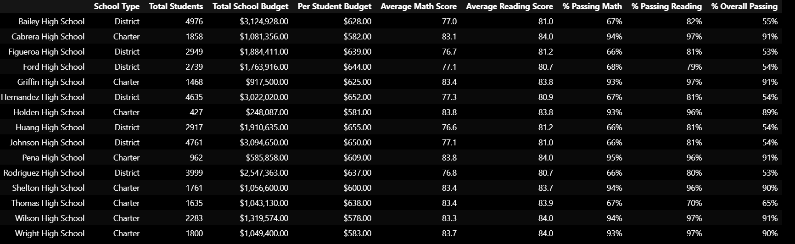
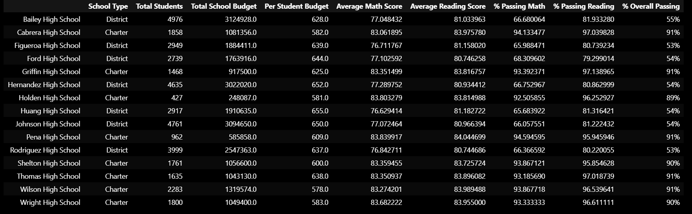

# School District Analysis
## Overview of the school district analysis: 

This analysis generated dataframes using test data to inform school board decision making. There were two phases to this analysis: first, with complete data for all students from the included high schools and then, with select data excluded based on evidence of academic dishonesty. 

The code for the first phase analysis can be found in PyCitySchools_Initial_Analysis. The first step was to explore and clean the data. Then I generated the first, overarching school district summary (calculating the number of students, number of schools, the total budget, test score averages, passing percentages). I also generated additional data frames: a summary for each school, high and low performing schools, average math and reading scores by grade, scores grouped school spending per student, scores grouped by school size, and scores grouped by school type. 

The second analysis required replacing the ninth grade scores for Thomas High School with null values and then re-runing the school district analysis based on the modified data. This code can be found in PyCitySchools_Challenge. 

## Tools:
* Python 3.10.2
* VS Code 1.65.0
* Pandas
* NumPy

## Results: 

### How is the district summary affected?

As seen below, there is little to no affect on the overall district summary by excluding the reading and math scores of ninth graders from Thomas High School. 

Initial District Summary

Secondary District Summary 

### How is the school summary affected?

The images below reflect three summaries: one for the initial analysis and two for the secondary analysis. The secondary analysis has two summaries because the student count needed to be adjusted for Thomas High School to exclude the 9th grade students. This is reflected in the very low passing percentages in the not adjusted summary vs the high passing percentages in the adjusted summary. The adjusted, more accurate summary shows little overall change in THS's passing percentages; they stayed high as is typical for the Charter Schools in this dataset (see summary by school type). 

Initial Per School Summary 

Secondary Per School Summary - Not Adjusted  

Secondary Per School Summary - Adjusted 

### How does replacing the ninth graders’ math and reading scores affect Thomas High School’s performance relative to the other schools?

The tables below show Thomas High School's ranking in the top 5 performing schools before and after the exclusion of ninth grade scores. I have included the unformatted versions so that we can see the small changes; when the overall percentage is formatted to 0 decimal points, the change is not seen. Looking closely at the percentages, we can see that the % Passing Math, % Passing Reading, and % Overall Passing all fell by a small amount (between a tenth and a third of a percent for each).  

Initial Top 5 Performing Schools

Secondary Top 5 Performing Schools 

### How does replacing the ninth-grade scores affect the following:

### Math Scores By Grade

The below tables for math and reading scores by grade show that THS ninth graders' scores have been replaced by NaN. 

Initial Math Scores by Grade 

Secondary Math Scores by Grade 

### Reading Scores By Grade

Initial Reading Scores by Grade 

Secondary Reading Scores by Grade 

### Scores by school spending

The following three categories - spending, size, and type - show no significant change.  If we looked to more decimal places, we might see a very slight change that is not reflected here. 

Initial Groupings by School Spending

Secondary Groupings by School Spending 

### Scores by school size

Initial Groupings by School Size 

Secondary Groupings by School Size 

### Scores by school type

Initial Groupings by School Type 

Secondary Groupings by School Type 

## Summary: 

To summarize, we can see the following changes in the summaries after adjusting our data for analysis:

* Looking closely at the passing percentages for Thomas High School, we can see that the % Passing Math, % Passing Reading, and % Overall Passing all fell by a small amount (between a tenth and a third of a percent for each).  

* The tables for math and reading scores by grade show that THS ninth graders' scores have been replaced by NaN. 

* The Secondary Per School Summary had to be adjusted to change the total student count from including all four grade levels at THS to excluding the ninth graders. The not adjusted table shows that the passing percentages would have falled into the 60% range, whereas the adjusted table shows that the passing percentages maintain in the mid to high 90% range. 

* No significant changes are seen when analyzing schools by spending, size, or type (with the caveat that these tables are formatted to a single decimal place or to a whole number). 

